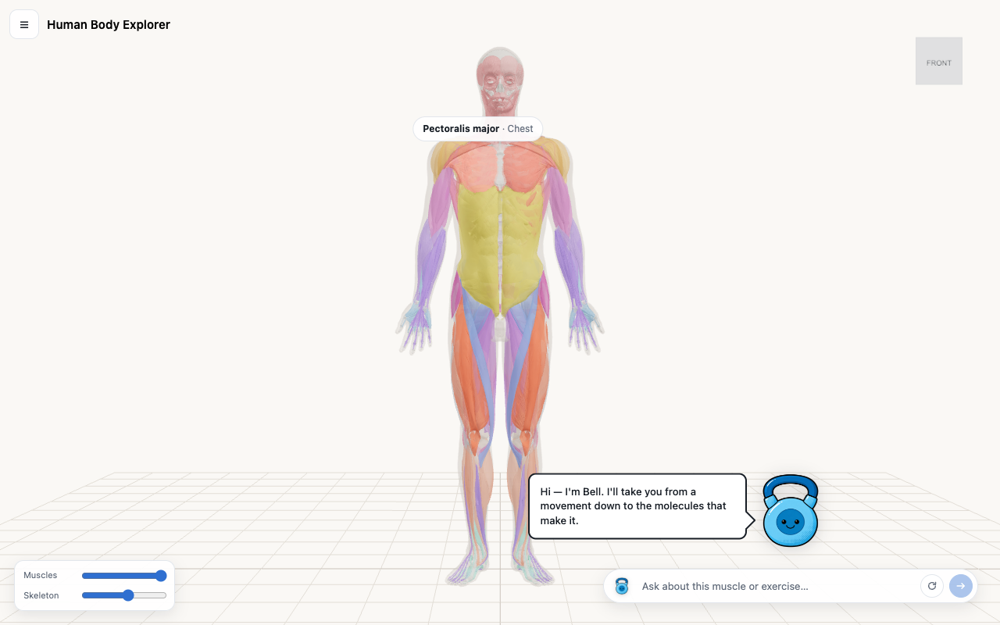
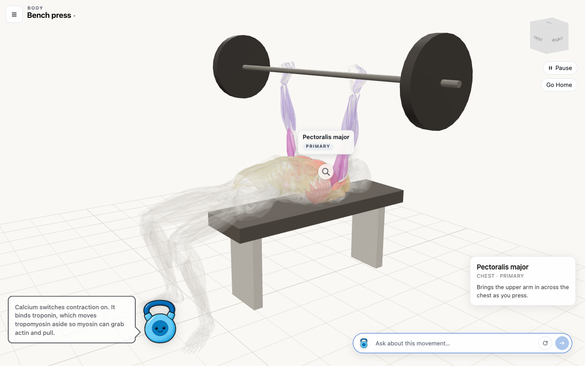
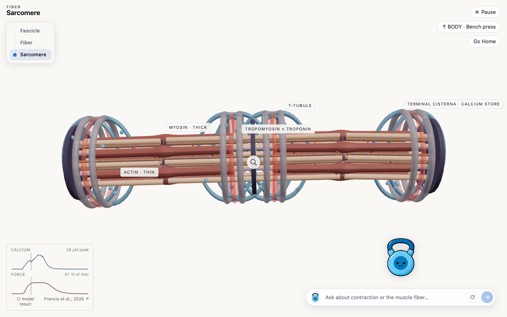
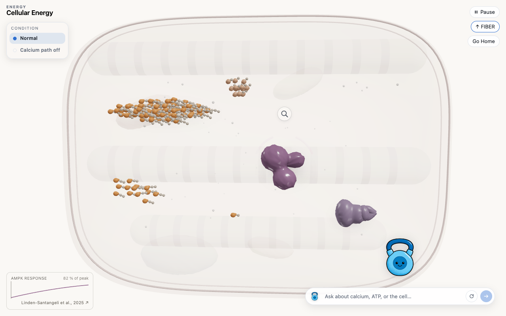
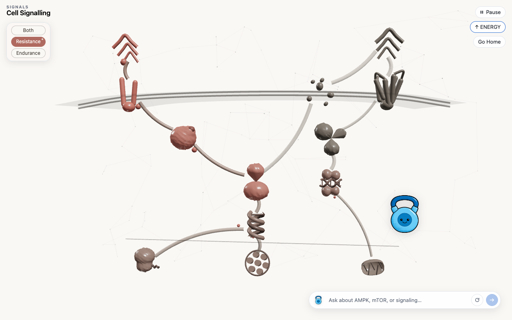
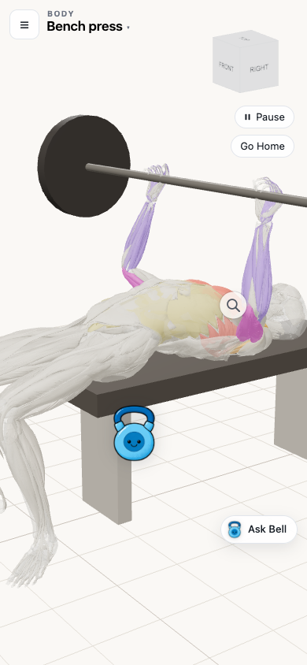

# Human Body Explorer

An interactive 3D explorer that follows one exercise from the moving body down
to the molecules that make it: body → muscle fibre → cell → signalling network.
Built on three published models from the UCSD Human Performance Alliance's
research area, with every number on screen traceable to the paper it came from.



## What this is for

A paper usually shows calcium, force, AMPK and signalling as separate graphs on
separate pages. The reader is left to hold cause and effect together in their
head. This puts them on one continuous surface instead: you pick a movement,
watch it run on a real anatomical body, choose a muscle it works, and go inside
that same muscle until you reach the chemistry driving it.

It is a first-year undergraduate's study of three papers, made explorable. It is
not a lab instrument and it is not a journal submission. The standard it holds
itself to is that nothing on screen claims more than its source supports.

## What a visitor does

**Pick a movement and watch it.** Six are animated: bench press, push-up,
pull-up, lunge, running and freestyle swimming. Muscles light by the role they
play in that movement, and a timeline shows the shape of the repetition rather
than only how far through it is.



**Go inside.** Pressing the lens on a muscle descends a floor, carrying the
muscle you came in through with you. The four floors are:

| Floor | What you are looking at |
|---|---|
| Body | The whole anatomy, skin and skeleton on their own opacity sliders |
| Fibre | The fascicle and the sarcomere, contracting under the model's own calcium |
| Energy | The cell's ATP, phosphocreatine and calcium during a bout |
| Signals | The resistance and endurance signalling network, and what each drives |





**Ask Bell.** A character walks to whatever is being explained and says it in a
speech bubble. The question box reaches a live Claude model that is told what is
currently on screen, so "what does this muscle do" resolves against the muscle
you actually have selected. It can also move you between floors when you ask it
to.



## The science

Three papers, one per floor below the body. Each is linked by its pinned DOI
inside the app, under Data in the drawer.

| Floor | Paper | Venue | Supplies |
|---|---|---|---|
| Fibre | Francis et al., 2025 | bioRxiv preprint, [10.1101/2025.05.22.655415](https://doi.org/10.1101/2025.05.22.655415) | Calcium handling, force and fatigue |
| Energy | Linden-Santangeli et al., 2025 | npj Systems Biology and Applications, [10.1038/s41540-025-00588-w](https://doi.org/10.1038/s41540-025-00588-w) | AMPK under energy stress |
| Signals | Fowler et al., 2024 | Experimental Physiology, [10.1113/EP091712](https://doi.org/10.1113/EP091712) | Resistance versus endurance signalling |

The models are run offline and the app draws the archived output. It does not
re-fit published parameters and it does not compute new science of its own.

### What was checked, and what was not

All three ports carry the label `Derived`, not `Modelled`, and that distinction
is enforced rather than promised — no code path in the project can emit
`Modelled` at all.

| Paper | Checked against the authors' own numbers | The gap that stops `Modelled` |
|---|---|---|
| Francis et al. | 198,656 right-hand-side doubles, 0 mismatches | Their solver, MATLAB `ode15s` with `NonNegative`, cannot be run here |
| Linden-Santangeli et al. | 72 published Sobol indices, 72 of 72 at printed precision | The exported trajectories have no published counterpart; the posteriors are absent |
| Fowler et al. | 23,980 published doubles, 23,738 matched | The paper's own validation cannot be recomputed from the archive |

Fowler et al. report their model scoring 18 of 21 on resistance and 12 of 16 on
endurance against nine published papers. Those figures are transcribed from
their Figure 3 and shown behind the source line in the app. They are quoted,
never recomputed.

## Limitations

**Two things on the body floor have no published source behind them, and say
so.** Which muscles light up for a given exercise is a curated mapping, and the
brightness curve for effort is hand-authored. Both are standard
exercise-science attributions that have not been reviewed.

**The archives are a grid, not a simulator.** Ask for an input the scenario grid
does not cover and the app says so on screen rather than quietly snapping to the
nearest one it has.

**The anatomy geometry has its own defects.** Roughly 4.7% of the body surface
has muscle geometry sitting outside the skin shell, which shows if you turn the
skin opacity up. The skin shell is the unmodified source scan and is off by
default.

**Bell's answers are generated live and are not reviewed content.** The model is
instructed not to invent measurements and to defer to the numbers the app draws,
which carry their own provenance, but a generated sentence is not a cited one.
Reply length is capped by the prompt and the cap is not perfectly reliable; long
answers scroll inside the bubble.

**The licences are named on screen but not yet linked**, which the ShareAlike
attribution clause asks for. The credit line below is the authoritative one.

## Running it locally

Node 25.9.0 is pinned in `.nvmrc`.

```bash
npm install
npm run dev      # development server
npm run build    # production build to dist/
npm run test:unit
```

For the assistant, create `.env.local` in the repository root:

```bash
ANTHROPIC_API_KEY=sk-ant-your-key-here
ASSISTANT_MODEL=claude-haiku-4-5   # optional
```

The variable deliberately carries no `VITE_` prefix, so Vite cannot expose it to
the browser. It is read only by the dev server and by the serverless function,
and nothing under `src/` references it. Without a key the 3D application works
in full and only the assistant reports itself unconnected.

### Deployment

`api/assistant.js` mounts the same request handler as the development middleware
in `server/assistantMiddleware.js`, so a deployed site has the endpoint the dev
server has. Set `ANTHROPIC_API_KEY` (and optionally `ASSISTANT_MODEL`) as
environment variables in the hosting project. The system prompt, the tool
definitions and the key all stay in `server/`, which is imported by the Vite
config and by the function and by nothing the browser ever receives.

## Attribution and licence

The anatomical meshes are derived from two openly licensed sets and are
redistributed here under those same terms:

- **BodyParts3D**, © The Database Center for Life Science, licensed
  [CC BY-SA 2.1 Japan](https://creativecommons.org/licenses/by-sa/2.1/jp/) —
  muscle and bone meshes
- **Z-Anatomy** by Gauthier Kervyn, licensed
  [CC BY-SA 4.0](https://creativecommons.org/licenses/by-sa/4.0/) — the
  remaining muscle meshes

The mesh set is derived from [BodyExplorer](https://github.com/johanbellander/BodyExplorer).
Because both upstream licences are ShareAlike, the mesh assets in `public/models/`
and any modified version of them must be distributed under the same terms.

The three models remain the property of their authors and are cited above. The
research programme this study is built on is the UCSD Human Performance
Alliance.
